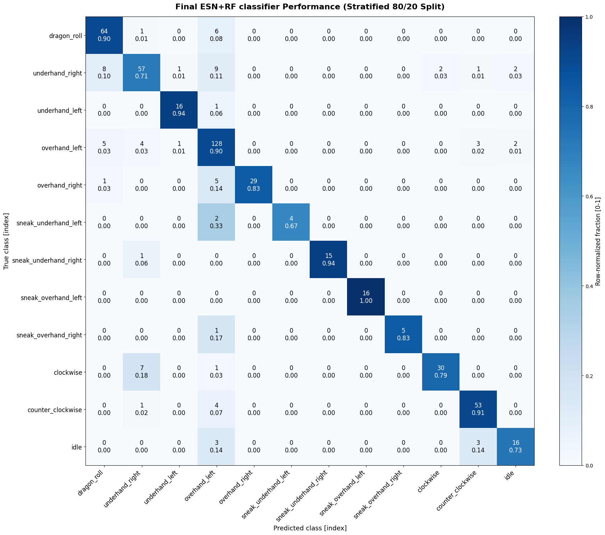
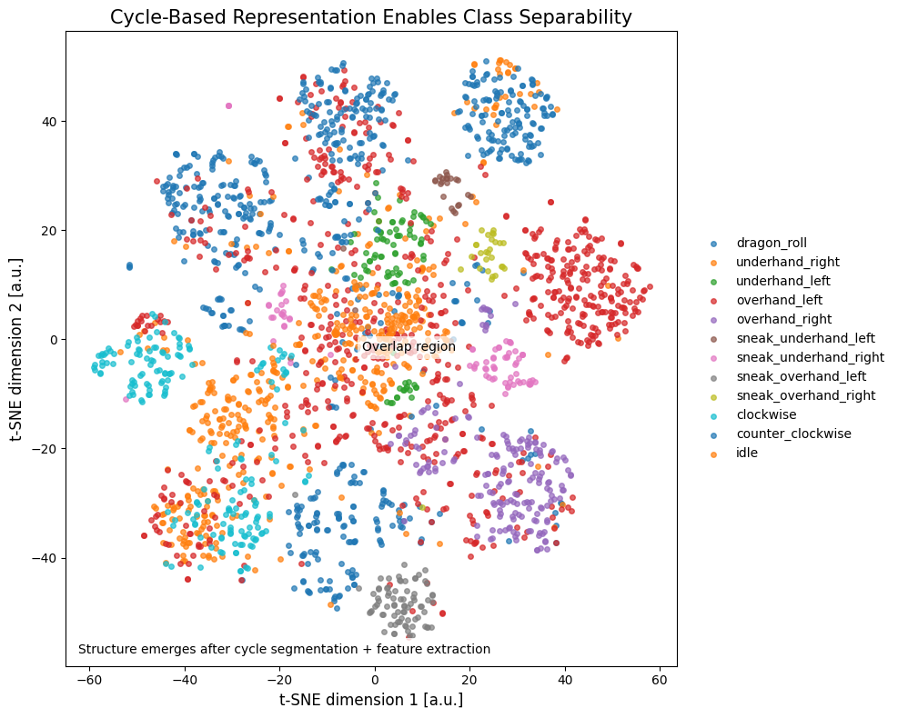
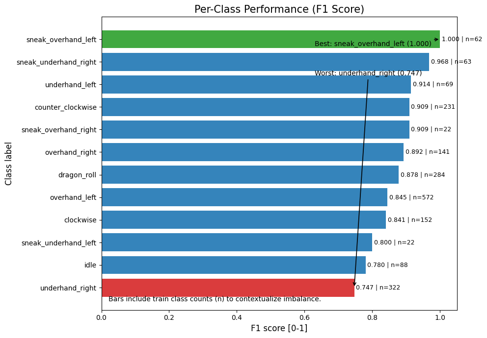
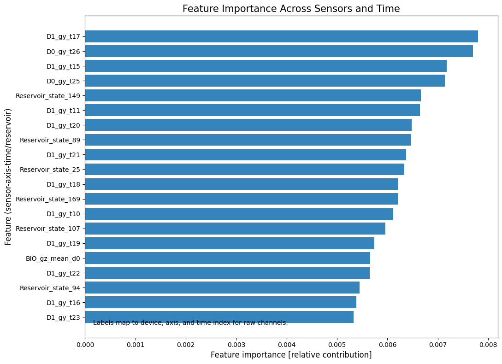

<p align="center">
  <h1 align="center">🌀 Rope Flow Motion Classification</h1>
  <p align="center">
    <strong>Classifying 12 rope flow movement patterns from dual wrist-mounted IMUs using Echo State Networks</strong>
  </p>
  <p align="center">
    
    
    
    
    
  </p>
</p>

---

## 🎯 Key Results

| Metric | Value |
|:---|:---|
| **Accuracy** | **87.9%** |
| **Macro F1** | **0.89** |
| Classes | 12 |
| Labeled cycles | ~2,500 |
| Evaluation | Stratified 80/20 split + semi-supervised pseudo-labeling |

<p align="center">
  
  
</p>
<p align="center">
  
  
</p>

---

## ⚙️ Pipeline Overview

```
Raw IMU (50 Hz, 2 wrists × 6 axes)
  → Preprocessing (Madgwick filter, gravity removal, resampling)
  → Cycle Detection (peaks in ‖ω‖, 32-sample fixed windows)
  → Feature Extraction:
      ├── Flattened raw waveform (384D)
      ├── Biomechanical feature: mean signed gz (1D)
      └── Echo State Network embedding (200D)
  → Random Forest (400 trees) → 12 movement classes
```

The **Echo State Network** (reservoir computing) passes each 12×32 cycle matrix through a fixed recurrent reservoir of 200 neurons, capturing temporal dynamics without backpropagation. The reservoir's mean state is concatenated with the raw waveform for a total of **585 features**.

---

## 📊 Dataset

| | |
|:---|:---|
| **Sensors** | 2× M5StickC Plus 1.1 (wrist-mounted, 6-axis IMU) |
| **Subjects** | 2 (Jo, Oli) |
| **Sessions** | 51 total (11 homogeneous + 15 heterogeneous + 25 unlabeled) |
| **Sampling rate** | ~49 Hz raw → 50 Hz resampled |
| **Labeling** | Whisper speech-to-text → spectral alignment → manual L/R correction |

<details>
<summary><strong>📋 12 Movement Classes</strong></summary>

| # | Class | Description |
|:--|:------|:------------|
| 1 | `underhand_left` | Underhand figure-8, left-initiated |
| 2 | `underhand_right` | Underhand figure-8, right-initiated |
| 3 | `overhand_left` | Overhand figure-8, left-initiated |
| 4 | `overhand_right` | Overhand figure-8, right-initiated |
| 5 | `sneak_underhand_left` | Sneak (behind back) + underhand, left |
| 6 | `sneak_underhand_right` | Sneak (behind back) + underhand, right |
| 7 | `sneak_overhand_left` | Sneak (behind back) + overhand, left |
| 8 | `sneak_overhand_right` | Sneak (behind back) + overhand, right |
| 9 | `dragon_roll` | Palm-flip rotation, arms never cross midline |
| 10 | `clockwise` | Rotational transition (CW) |
| 11 | `counter_clockwise` | Rotational transition (CCW) |
| 12 | `idle` | Stationary / transition pause |

</details>

---

## 📁 Repo Structure

```
ropeflow-project/
├── Final submission/
│   └── 12_Full_Pipeline_v12.ipynb      ← Final pipeline (run this)
├── src/
│   ├── Data_processing/                ← Preprocessing pipeline (v1–v8)
│   └── Full pipeline/                  ← Classification iterations (V01–V12)
│       └── colab_experiments/          ← 18 standalone experiment notebooks
├── data/
│   ├── raw/
│   │   ├── new-labeled-sessions/       ← 19 sessions with per-cycle JSON labels
│   │   ├── unified-data/               ← Raw IMU recordings
│   │   └── app-data/                   ← Early app-collected sessions
│   └── processed/                      ← 51 sessions × 2 devices (preprocessed CSVs)
├── assets/                             ← Plots and demo media
├── docs/                               ← Project proposal
└── results/                            ← Saved outputs
```

---

## 🚀 Quick Start

```bash
# Clone
git clone https://github.com/helenejabbour/ropeflow-project.git
cd ropeflow-project

# Install dependencies
pip install numpy scipy matplotlib scikit-learn pandas openpyxl

# Run the final pipeline
jupyter notebook "Final submission/12_Full_Pipeline_v12.ipynb"
```

<details>
<summary><strong>Google Colab</strong></summary>

1. Upload `12_Full_Pipeline_v12.ipynb` to Colab
2. Clone the repo in a cell: `!git clone https://github.com/helenejabbour/ropeflow-project.git`
3. Set `ROOT = 'ropeflow-project'` in the CONFIG cell
4. Run all cells

</details>

---

## 👥 Team & Course

| | |
|:---|:---|
| **Team** | Helene Jabbour and Mounir Khalil
| **Course** | EECE 798K / MECH 798M — Data-Driven Modeling, AUB — [ml4science.com](https://ml4science.com) |
| **Instructor** | Prof. Joseph Bakarji |

---

<p align="center"><em>Built with IMUs, reservoir computing, and a whole lot of rope swinging.</em></p>
